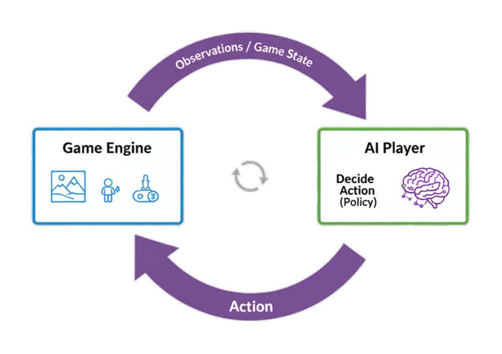

# Overview

**Taru Tech AI Playtest: From Zero to AI Player in Minutes**

Similar to humans that need to observe the game and interact with the game using provided interaction mechanisms, to enable your game to be playable for AI, game engines need to send observations to AI and receive input from the AI side. 

That's what the Taru Tech AI Playtest SDK is all about. We provide a suite of powerful, intuitive components that sit on top of Unity ML-Agents, letting you focus on your game's logic, not on the complexities of the framework.

