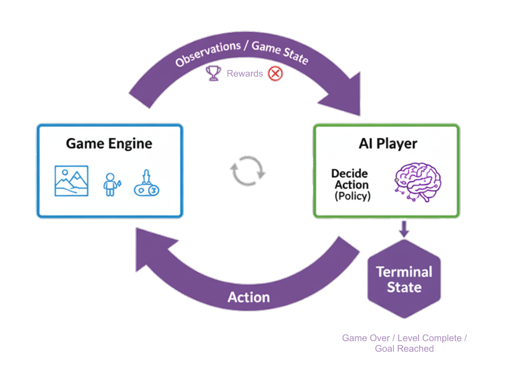

# Getting started


**Taru Tech AI Playtest: From Zero to AI Player in Minutes**

Similar to humans that need to observe the game and interact with the game using provided interaction mechanisms, to enable your game to be playable for AI, game engines need to send observations to AI and receive input from the AI side. 

That's what the Taru Tech AI Playtest SDK is all about. We provide a suite of powerful, intuitive components that sit on top of Unity ML-Agents, letting you focus on your game's logic, not on the complexities of the framework….



In this guide, we'll walk you through the entire process: setting up your project, turning a regular GameObject into a thinking AI (AI Agent), and connecting it to our cloud platform for training and playtesting. Let's get started.

**Part 1: The Core Concepts \- How it Works**

Our system is built on four simple modules that work together on your AI-controlled object (AI Agent).

1. The Playtest Agent (script component): This is the brain. It's the main component that connects to the Taru Tech AI server and acts as the central nervous system for your AI.

2. The Playtest Observer (script component): These are the AI's senses. You build your AI's perception of the world by adding modular "Observation Sources" to a list. Want the AI to know its position? Add a Vector3Source. Want it to know the player's health? Add a FloatValueSource.   
     
3. The Player Input (if System Input is enabled) or Playtest Action Receiver (script component): These are the AI's hands. When the AI decides to act, this component translates that decision into an action in your game. It uses standard Unity Events or Unity Input System, so you can easily hook up the AI's decisions to your existing game functions, like Player.Jump() or Enemy.FireWeapon().   
     
4. Gameplay Metrics Sender (script instance): This sends a custom list of gameplay metrics to the trainer, which you can use to shape the AI's rewards and analyze its behavior on your Taru Tech dashboard.


### Create a Page

Add **Markdown or React** files to `src/pages` to create a **standalone page**:

- `src/pages/index.js` → `localhost:3000/`
- `src/pages/foo.md` → `localhost:3000/foo`
- `src/pages/foo/bar.js` → `localhost:3000/foo/bar`

### Create your first React Page

Create a file at `src/pages/my-react-page.js`:

```jsx title="src/pages/my-react-page.js"
import React from 'react';
import Layout from '@theme/Layout';

export default function MyReactPage() {
  return (
    <Layout>
      <h1>My React page</h1>
      <p>This is a React page</p>
    </Layout>
  );
}
```

A new page is now available at [http://localhost:3000/my-react-page](http://localhost:3000/my-react-page).

### Create your first Markdown Page

Create a file at `src/pages/my-markdown-page.md`:

```mdx title="src/pages/my-markdown-page.md"
# My Markdown page

This is a Markdown page
```

A new page is now available at [http://localhost:3000/my-markdown-page](http://localhost:3000/my-markdown-page).
